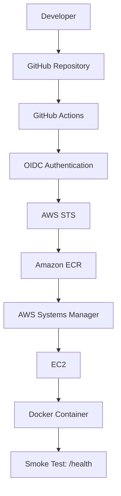
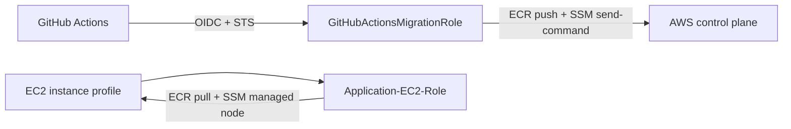
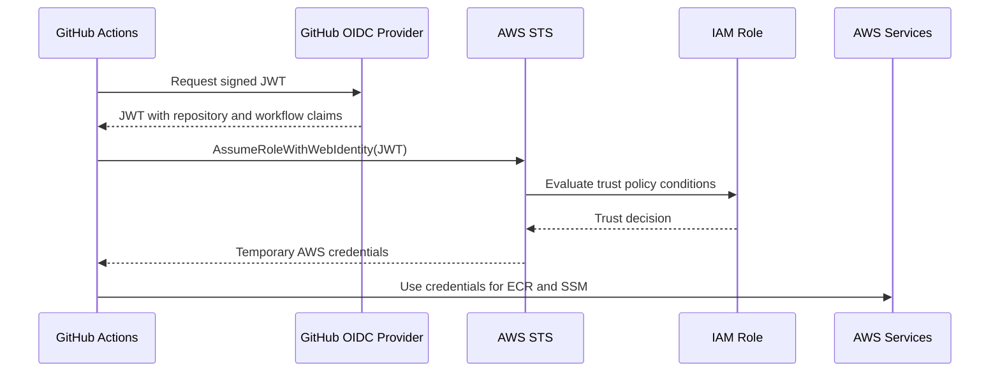

# Jenkins to GitHub Actions Migration

> Migrated a Jenkins-based CI/CD pipeline to GitHub Actions using GitHub OIDC, AWS STS, Docker, Amazon ECR, and AWS Systems Manager.

This project is an engineering case study of a CI/CD migration for a small Node.js application. The delivery path builds and tests the application, packages it into a Docker image, publishes the image to Amazon ECR, and deploys it to EC2 through AWS Systems Manager. The repository also retains the Jenkins pipeline so the old and new delivery models can be compared directly.

The goal was not only to replace one automation tool with another. The work focused on reducing credential risk, removing SSH-based deployment steps, making releases traceable to source commits, and documenting the operational decisions that make a pipeline understandable to the next engineer.

## Project Highlights

- Migrated the delivery flow from Jenkins to GitHub Actions.
- Replaced long-lived GitHub AWS credentials with GitHub OIDC and temporary AWS STS credentials.
- Built a production-style Docker image for a Node.js 20 Express application.
- Published immutable, commit-SHA-tagged images to Amazon ECR.
- Deployed to EC2 through AWS Systems Manager Run Command instead of SSH.
- Added automated application tests, a health endpoint, and a post-deployment smoke test.
- Preserved the Jenkinsfile as a reference implementation for migration comparison.
- Used a non-root Docker user and production-only container dependencies.
- Documented real integration risks involving IAM, ECR permissions, repository claims, ports, and region configuration.
- Designed the EC2 host around a small, cost-conscious deployment footprint.

## Architecture



### Deployment flow

1. A developer opens a pull request or pushes to `main`.
2. GitHub Actions checks out the repository, installs Node.js 20 dependencies, and runs the application tests.
3. The workflow requests a short-lived OIDC-backed AWS session by assuming `GitHubActionsMigrationRole` through AWS STS.
4. The workflow authenticates Docker to Amazon ECR, builds the image, and tags it with the GitHub commit SHA.
5. The image is pushed to the `jenkins-to-github-migration` ECR repository.
6. The deployment job starts only after the build, test, and push job succeeds.
7. The workflow calls AWS Systems Manager Run Command on the target EC2 instance.
8. The instance logs into ECR, pulls the exact commit image, replaces the existing `app` container, and maps host port `8082` to container port `8080`.
9. GitHub Actions calls the public health endpoint and fails the workflow if the deployment does not respond successfully.

This sequence creates a clear release boundary: an image is not deployed merely because a container build succeeded locally; it must pass the repository tests and be available in the target registry first.

## Why This Project Exists

### The Jenkins problem

Jenkins can run the required steps, but the pipeline depends on maintaining a separate server, its plugins, its agents, its credentials, and its access to Docker. That creates operational work outside the application repository. A Jenkins agent also needs the right versions of Node.js, Docker, AWS CLI, and Java before the pipeline can run consistently.

The original `Jenkinsfile` remains in this repository. It shows the earlier sequence: checkout, test, AWS configuration, Docker build, ECR login, image push, deployment, and smoke testing. Keeping it available makes the migration auditable instead of presenting the GitHub Actions workflow as if it appeared without a predecessor.

### Why GitHub Actions

GitHub Actions was chosen because the source repository, pull requests, branch events, workflow definition, and build history are managed in one place. The workflow is versioned with the application, so a change to the delivery process can be reviewed like any other code change.

This also reduces the amount of separately managed CI infrastructure. GitHub-hosted runners provide an ephemeral build environment, while the EC2 host is used only as the deployment target and runtime environment.

### Why OIDC replaced access keys

Storing an AWS access key in GitHub creates a secret that can be copied, leaked, forgotten, or left active longer than intended. GitHub OIDC allows the workflow to present a signed identity token to AWS. AWS STS exchanges that trusted identity for temporary credentials.

The practical benefit is reduced secret lifetime and a narrower trust decision. AWS can restrict the role trust policy to the intended GitHub organization, repository, branch, or workflow subject rather than accepting a reusable static key.

### Why Systems Manager replaced SSH

SSH requires a reachable port, key distribution, key rotation, and a process for protecting private keys. Systems Manager uses an agent and an IAM instance role to receive commands through AWS control-plane services. This removes the need to distribute an SSH private key to the CI system and allows command execution to be audited in AWS.

SSM is not a substitute for authorization. The workflow role still needs permission to send commands, and the EC2 role still needs permission to register with SSM and perform the instance-side actions.

## Technology Stack

| Category | Technology | Why it is used |
| --- | --- | --- |
| CI/CD | GitHub Actions | Versioned automation close to the source repository |
| CI/CD reference | Jenkins | Original pipeline retained for migration comparison |
| Cloud | AWS EC2 | Application runtime host |
| Cloud registry | Amazon ECR | Private registry for release images |
| Cloud access | AWS STS | Issues temporary credentials after role assumption |
| Remote operations | AWS Systems Manager | Runs deployment commands without SSH |
| Identity federation | GitHub OIDC | Establishes workflow identity without stored AWS keys |
| Containers | Docker | Packages the application and its production runtime |
| Runtime | Node.js 20 | Runs the Express service and matches the CI workflow |
| Web framework | Express 5 | Serves the frontend and JSON endpoints |
| Security headers | Helmet | Adds baseline HTTP security headers |
| Compression | compression | Reduces response size for served content |
| Infrastructure host tooling | Docker, Jenkins, Java 21, AWS CLI | Supports the EC2 deployment and Jenkins comparison setup |

## Repository Structure

```text
.
|-- .github/
|   `-- workflows/
|       `-- cicd.yml       GitHub Actions build and deployment workflow
|-- public/
|   |-- app.js              Frontend behavior
|   |-- index.html          Application page
|   `-- styles.css          Application styling
|-- Dockerfile              Node.js production image definition
|-- Jenkinsfile             Original Jenkins pipeline
|-- package.json            Application metadata and npm scripts
|-- server.js               Express server, static files, and API routes
|-- test.js                 Health, homepage, and migration API tests
|-- script                  Manual host setup commands and bootstrap material
`-- README.md               Project architecture and operating guide
```

## Running Locally

### Prerequisites

- Node.js 20 or later
- npm
- A shell that can run the project scripts

Install the dependencies:

```bash
npm install
```

Run the application tests:

```bash
npm test
```

The tests start the server on an ephemeral local port and verify the health endpoint, homepage, and migration API. They also check key response values such as the service owner, title, six pipeline stages, and Amazon ECR registry name.

Start the application:

```bash
npm start
```

The default port is `8080`. Set `PORT` to use another port:

```bash
PORT=8081 npm start
```

Local endpoints:

| Endpoint | Purpose |
| --- | --- |
| `http://localhost:8080/` | Frontend application |
| `http://localhost:8080/health` | JSON health check |
| `http://localhost:8080/api/migration` | Pipeline metadata API |

## Docker

The `Dockerfile` uses `node:20-alpine` as the base image, copies package metadata first, installs production dependencies, copies the application files, exposes port `8080`, and starts the service with `npm start`.

The image runs as the built-in non-root `node` user. This limits the impact of an application-level compromise compared with running the process as root. The image also uses production dependencies only, which reduces image size and removes development tooling from the runtime layer.

Build the image locally:

```bash
docker build -t jenkins-to-github-migration:local .
```

Run it:

```bash
docker run --rm --name migration-app -p 8080:8080 jenkins-to-github-migration:local
```

Verify the container:

```bash
curl http://localhost:8080/health
```

The GitHub Actions workflow tags the registry image with `${{ github.sha }}`. A commit SHA is preferable to a mutable tag such as `latest` because it gives each deployment an exact source reference and makes rollback investigation easier.

## AWS Infrastructure

The target runtime is a single EC2 host in AWS. The project configuration uses a cost-conscious `t2.medium` Spot instance in `us-east-1`, with one instance request, a maximum Spot price of `$0.03`, a public IP, the default VPC, and security group `sg-0d5c43e9c781a2b57` (`MyBlogSecurityGroup`). Spot capacity lowers cost but can be interrupted, so this setup is appropriate for a demonstration or non-critical environment rather than a stateful production service.

The security group must permit the traffic required by the application and smoke test. The deployment maps host port `8082` to container port `8080`, so inbound TCP `8082` must be restricted to trusted sources. The instance also needs outbound access to ECR, Systems Manager, package repositories, and any other service required during bootstrap.

### Host software

The EC2 user-data bootstrap installs:

- Docker Engine and Docker Compose plugin for image execution.
- Java 21 and fontconfig for Jenkins compatibility.
- Jenkins for comparison with the migrated pipeline.
- AWS CLI v2 for AWS and ECR operations.

User data exists to make a newly launched host repeatable: the instance receives the bootstrap at launch rather than depending on a person to install every package manually. The AMI must be Ubuntu-compatible because the script uses `apt` and Ubuntu repository conventions.

## IAM Architecture

The design separates the identity used by the CI workflow from the identity used by the EC2 host. They have different callers and different jobs, so combining them would make a compromise in one place more powerful than necessary.

### Role 1: `GitHubActionsMigrationRole`

**Who assumes it:** The GitHub Actions workflow assumes this role through GitHub OIDC and AWS STS. The trust policy should match the intended repository and branch or workflow subject, as well as the expected OIDC audience `sts.amazonaws.com`.

**What it needs:** The role needs only the actions required by this workflow: identity verification, ECR authentication and image push, and Systems Manager command execution against the intended EC2 target. The exact policy must be reviewed in AWS; the repository references the role but does not include a complete IAM permissions policy.

**Why it is never attached to EC2:** This role represents a GitHub workload, not an application host. Attaching it to EC2 would give the instance permissions intended for the CI control plane, potentially including the ability to push images or issue commands. Keeping the roles separate limits blast radius and makes CloudTrail activity easier to interpret.

### Role 2: `Application-EC2-Role`

**Why it is attached to EC2:** The EC2 instance needs an instance profile so the SSM agent can register and receive commands, and so host-side Docker commands can authenticate to ECR without storing an AWS access key on disk.

**Why ECR ReadOnly:** The running host needs to pull release images. It does not need to create repositories, push layers, delete images, or modify registry configuration. Read-only ECR access matches the runtime requirement and avoids granting build-system permissions to the application host.

**Why `AmazonSSMManagedInstanceCore`:** This AWS-managed policy provides the baseline permissions required for the instance to function as a Systems Manager managed node. It enables the control-plane relationship used by the deployment job.

The role names above describe the intended IAM boundary. They must exist in the AWS account with policies and trust relationships reviewed before deployment.



## GitHub OIDC Authentication

OIDC is a federation mechanism. GitHub creates a signed JWT for the workflow. The JWT contains claims describing the issuer, audience, repository, ref, and workflow identity. The workflow presents that token to AWS STS when requesting role credentials.

AWS validates the token signature and the conditions in the IAM role trust policy. If the claims match, STS returns temporary credentials. GitHub Actions uses those credentials for the duration of the job, then they expire.



This removes the need for an AWS access key in GitHub Secrets. It does not remove the need for careful IAM: authentication answers "who is this?" while authorization answers "what may this identity do?" Both must be correct.

## CI/CD Workflow

The workflow is triggered by pushes and pull requests targeting `main`. It defines two jobs so deployment has an explicit dependency on a successful build path.

### Build Job

The `build-test-push` job runs on `ubuntu-latest` and performs the following steps:

1. **Checkout:** Retrieves the exact repository revision being evaluated.
2. **Node.js setup:** Installs Node.js 20 to match local development and the Docker runtime.
3. **Dependency installation:** Runs `npm install` to install the application dependencies needed by the tests and build context.
4. **Tests:** Runs `npm test`, which exercises the health endpoint, homepage, and migration API.
5. **OIDC authentication:** Assumes `GitHubActionsMigrationRole` through `aws-actions/configure-aws-credentials`.
6. **Identity verification:** Runs `aws sts get-caller-identity` to make the active AWS identity visible in the build log.
7. **ECR login:** Uses the Amazon ECR login action to configure Docker authentication.
8. **Image build:** Builds the Docker image and tags it with the commit SHA.
9. **Image push:** Pushes the image to the configured ECR repository.

The order matters. Tests run before AWS publishing so a failing application does not become a release image by default.

### Deployment Job

The `deploy` job declares `needs: build-test-push`. It assumes the same GitHub Actions role, sends an `AWS-RunShellScript` command to the configured EC2 instance, and waits for the SSM command to finish.

The remote command logs Docker into ECR, pulls the commit-tagged image, stops the existing `app` container, removes it, and starts the replacement on `8082:8080`. The final step calls the public `/health` endpoint and uses `curl --fail`, so an HTTP failure causes the workflow to fail.

Deployment is deliberately downstream of the build job. This prevents the deployment job from pulling an image that was never tested or successfully pushed, and it makes the workflow result easier to reason about during an incident.

### Required repository variables

| Variable | Purpose |
| --- | --- |
| `AWS_ACCOUNT_ID` | Account containing the IAM role, ECR, and EC2 resources |
| `EC2_INSTANCE_ID` | SSM-managed deployment target |
| `EC2_PUBLIC_IP` | Address used by the final smoke test |

The workflow sets `AWS_REGION` to `us-east-1`. The current deployment step contains an ECR registry string with an `ap-south-1` suffix, while the project is otherwise configured for `us-east-1`. These values must be made consistent before a real deployment; otherwise the workflow may authenticate to or pull from the wrong registry.

## Engineering Decisions

### Decision: OIDC instead of access keys

**What:** GitHub Actions assumes an AWS IAM role using a GitHub-issued OIDC token.

**Why:** Static keys create long-lived secrets that require storage and rotation. OIDC lets AWS issue temporary credentials only to a trusted workflow identity.

**Benefit:** Lower credential exposure and clearer repository-level trust conditions.

### Decision: SSM instead of SSH

**What:** The workflow deploys by sending a command through AWS Systems Manager.

**Why:** SSH would require private-key handling and an exposed administrative path. SSM provides an AWS-audited command channel backed by the instance role.

**Benefit:** Fewer secrets in CI and less inbound network exposure.

### Decision: Two IAM roles

**What:** CI and EC2 use separate roles.

**Why:** The workflow pushes images and sends commands; the host pulls images and registers with SSM. Those are different trust boundaries.

**Benefit:** Least privilege and a smaller blast radius when a credential or workload is compromised.

### Decision: Non-root Docker user

**What:** The Dockerfile switches to the built-in `node` user before startup.

**Why:** The application does not need root privileges to serve port `8080` inside the container.

**Benefit:** A container escape or application vulnerability has fewer default privileges.

### Decision: Commit SHA image tagging

**What:** Images are tagged with `${{ github.sha }}`.

**Why:** Mutable tags hide which source revision is running.

**Benefit:** Better traceability, easier incident investigation, and a concrete rollback reference.

### Decision: Health endpoint and smoke test

**What:** The service exposes `/health`, and the deployment job calls it after replacement.

**Why:** A successful Docker command does not prove the application is reachable.

**Benefit:** The workflow checks the deployed service from outside the container process.

### Decision: Keep Jenkins as a reference

**What:** `Jenkinsfile` remains in the repository after the migration.

**Why:** Removing the old pipeline would hide the migration baseline and make comparison harder.

**Benefit:** Reviewers can see what changed and which delivery stages were preserved.

## Problems Faced

### Problem: Jenkins could not use Docker

**Root Cause:** The Jenkins service account and the interactive user are separate Linux identities. Installing Docker alone does not grant the Jenkins process permission to access the Docker socket.

**Investigation:** The bootstrap checks Docker installation separately from group membership. The important distinction is between a user being able to run Docker interactively and the Jenkins service being able to run it.

**Solution:** The host setup adds both the current user and `jenkins` to the `docker` group. A new login or service restart is required before group membership is effective. This is operationally convenient, but the Docker group is highly privileged and should be treated accordingly.

### Problem: CSS or frontend assets did not load after deployment

**Root Cause:** A deployment can report that the container started while the application still serves an incomplete or incorrect static-file path. Port mapping, the Docker build context, and Express's `public/` path all have to agree.

**Investigation:** The container was checked with `docker ps`, then the root page and asset URLs were requested from the mapped host port. Comparing the image contents with the `COPY public/ ./public/` instruction separates a build-context issue from an Express routing issue.

**Solution:** The Dockerfile copies the frontend directory into `/app/public`, and `server.js` serves that directory relative to the application root. The post-deployment health check remains necessary, but a browser or direct asset request is also required to verify the UI.

### Problem: GitHub OIDC subject claims were too restrictive or incorrect

**Root Cause:** The AWS trust policy must match the exact claims GitHub sends. A subject condition that uses the wrong repository, owner, branch, or claim format causes STS to reject the role assumption even when the workflow has `id-token: write` permission.

**Investigation:** The workflow's OIDC permission and the role trust conditions were compared. The AWS error was treated as a trust-policy problem first, rather than as an ECR authorization problem, because the failure occurred before AWS service calls could be made.

**Solution:** The trust policy must use the canonical GitHub OIDC issuer, the `sts.amazonaws.com` audience, and a subject pattern that matches the actual repository and ref. Subject values should be verified from the real repository configuration rather than copied from an example.

### Problem: ECR `InitiateLayerUpload` permission error

**Root Cause:** ECR image push is composed of several API operations. Granting permission to authenticate or describe a repository is not enough to upload image layers.

**Investigation:** The failing action was identified from the AWS error rather than treating all ECR failures as login failures. The workflow was checked to distinguish ECR authentication from the later Docker push operation.

**Solution:** The GitHub Actions role must allow the ECR upload actions required by Docker push, including layer upload, layer completion, image upload, and repository access. The repository must also exist in the same region as the registry URL used by the job.

### Problem: Region mismatch during deployment

**Root Cause:** The workflow declares `AWS_REGION=us-east-1`, but its deployment registry string currently uses `ap-south-1`.

**Investigation:** The region was compared across the AWS credential action, ECR login behavior, ECR registry hostname, and deployment command.

**Solution:** Use one region consistently for ECR authentication, image push, image pull, SSM commands, and the EC2 deployment target. This is a documented fix required before production use; the current repository still contains the conflicting suffix.

## Security Considerations

| Security decision | Why it matters | Implementation or action |
| --- | --- | --- |
| GitHub OIDC | Avoids long-lived AWS keys in GitHub | Trust `GitHubActionsMigrationRole` through the OIDC provider |
| Temporary STS credentials | Limits credential lifetime | Assume the role per workflow job |
| Separate CI and EC2 roles | Prevents cross-boundary privilege reuse | Use `GitHubActionsMigrationRole` for CI and `Application-EC2-Role` for EC2 |
| ECR read-only on EC2 | Runtime only needs to pull images | Do not grant image-push permissions to the host |
| SSM instead of SSH | Removes private-key distribution | Use an SSM-managed instance and `send-command` |
| Non-root container | Reduces process privileges | Run as the Docker `node` user |
| Restricted security group | Limits public attack surface | Allow only required ports and trusted sources |
| SHA image tags | Prevents ambiguous releases | Deploy the image tagged with the commit SHA |
| No secrets in source | Prevents accidental credential exposure | Store required repository values in GitHub configuration and AWS IAM |
| Spot capacity awareness | Spot instances can be interrupted | Use this footprint for non-critical workloads or add recovery automation |

## Deployment Verification

After the SSM deployment command completes, inspect the host:

```bash
docker ps
```

The expected output includes an `app` container with a port mapping similar to:

```text
0.0.0.0:8082->8080/tcp
```

Check the service from the deployment client:

```bash
curl --fail http://<EC2_PUBLIC_IP>:8082/health
```

Expected response shape:

```json
{
  "status": "UP",
  "service": "jenkins-github-actions-migration",
  "owner": "Arnold Bernard",
  "version": "1.0.0",
  "uptime": 12,
  "timestamp": "2026-09-16T12:00:00.000Z"
}
```

The exact `uptime` and `timestamp` values change on every request. The important verification is that the endpoint returns HTTP 200 and `status` is `UP`.

## Lessons Learned

- IAM debugging starts by separating authentication from authorization. A failed role assumption is not the same problem as a denied ECR API call.
- OIDC removes stored AWS keys, but it does not make the trust policy optional. Claims must match exactly.
- STS is the bridge between an external workload identity and temporary AWS permissions; understanding that exchange made the workflow easier to troubleshoot.
- Docker deployment has two separate concerns: building a valid image and running it with the correct port, files, user, and environment.
- A commit SHA is more useful operationally than a friendly mutable tag because it identifies the artifact that was tested and deployed.
- GitHub Actions is simpler to operate when the workflow is versioned alongside the application, but YAML configuration still needs the same review discipline as application code.
- A green container start is not a deployment verification. The health endpoint and an external smoke test provide stronger evidence.
- Debugging became faster when each failure was classified by boundary: GitHub identity, STS trust, IAM permission, ECR, SSM, Docker, networking, or application behavior.
- Authentication establishes identity; authorization defines allowed actions. Treating them as separate questions prevents many misleading fixes.

## Future Improvements

- [ ] Add automatic rollback to the last known-good SHA when the smoke test fails.
- [ ] Add Slack or Microsoft Teams deployment notifications.
- [ ] Add Trivy image vulnerability scanning before the ECR push.
- [ ] Add Checkov or an equivalent infrastructure policy scan.
- [ ] Add GitHub Environment approvals for production deployment.
- [ ] Add CloudWatch logs, metrics, and alarms for the EC2 host and application.
- [ ] Replace the single-host deployment with a resilient service when availability requirements increase.
- [ ] Add a deployment lock or concurrency control to prevent overlapping container replacements.
- [ ] Add automated verification that the ECR registry region matches `AWS_REGION`.
- [ ] Pin action versions and review dependency update changes as part of normal maintenance.

## Screenshots

Screenshots are intentionally kept as placeholders so they can be replaced with evidence from the real deployment rather than mock images.

### GitHub Actions success

``

Show the completed build, push, deployment, and smoke-test steps.

### Amazon ECR

``

Show the repository and the image tag associated with a Git commit SHA.

### EC2 terminal

``

Show `docker ps` with the `8082:8080` mapping.

### Browser health endpoint

``

Show the JSON response from the deployed public endpoint.

### Architecture

``

Show the final architecture and the trust boundaries between GitHub, AWS, and EC2.

## Author

**Arnold Bernard**

- GitHub: [github.com/your-github-username](https://github.com/your-github-username)
- LinkedIn: [linkedin.com/in/your-linkedin-profile](https://www.linkedin.com/in/your-linkedin-profile)

Replace the placeholder profile links with the author’s public profiles before sharing this repository with recruiters.